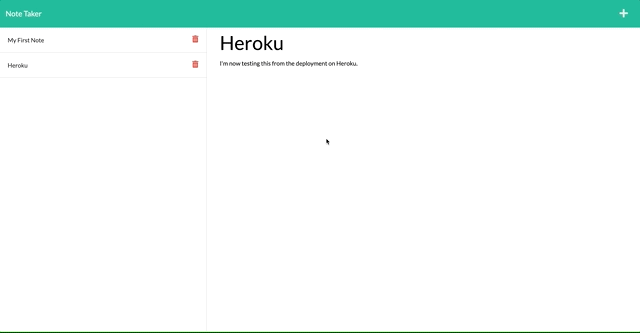

# ✏️ Note Taker

This web application uses Express.js to allow users to take notes and save them to a database (JSON file in this case). Users will be able to retrieve previously saved notes by clicking their title in the menu.

---

## Link to Deployed Application:
[Note Taker](https://arcane-reaches-81145.herokuapp.com/)

## Table of Contents
* [Technologies](#technologies)
* [Functionality](#functionality)
* [Challenges](#challenges)
* [Future Development](#future-development)
* [Contact](#contact)
* [License](#license)

## Technologies
* JavaScript
* Node.js
* Express.js
* Heroku

## Functionality

#### Landing Page and Viewing Existing Notes

#### Adding a New Note

#### Deleting a Note

## Challenges
- Of course, one of the big challenges here was to set up the routes correctly. Specifically, I first had some confusion as to whether I should use `/notes` or `/api/notes` for the requests. It turned out that using `/notes` worked for accessing the notes.html file, while `/api/notes` worked for actually dealing with the data. In hindsight, this should have been obvious, but that was my initial hold-up.
- Although the front end was already written, I spent a lot of time looking over it, just to have a good understanding of how the index.js file is organized and what it does.
- Another thing that should have been obvious, but wasn't, is that, given the setup of this project (the "database" being a file), the `delete` request should also read and  write to the db.json file.

## Future Development
- It would be nice to eventually add the ability for a user to edit a previously saved note, which would probably be done using a `put` request.
- While the application works, and I think I've accomplished the task at a high level, I think there will always be room for improvement in terms of the code's organization and adherence to best practices. I will continue learning more about Express.js best practices.

## Contact
Email me any time with questions, comments, or cat/dog photos! - ctbarrett.tech@gmail.com

## License
&copy; 2021 Charles Tucker Barrett

[MIT License](https://opensource.org/licenses/MIT)